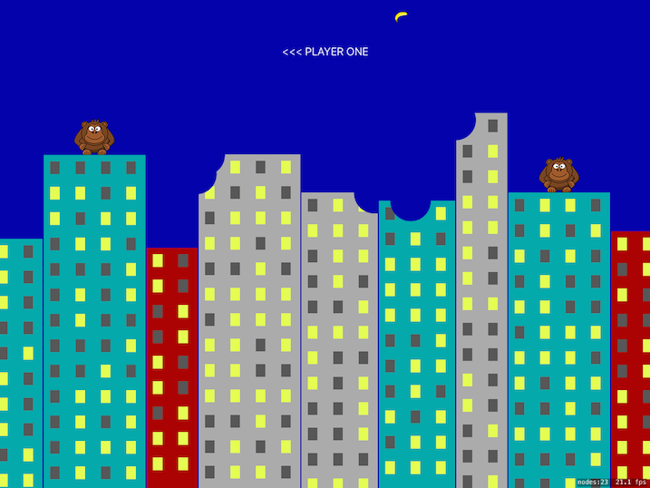

# ExplodingMonkeys
Repo following Project 29: Exploding Monkeys at Hacking with Swift



## Concepts learned/practiced
* Learned:
  * Scene transitions
    * Example:
    ```Swift
    let newGame = GameScene(size: self.size)
    let transition = SKTransition.crossFade(withDuration: 2)
    self.view?.presentScene(newGame, transition: transition)
    ```
  * Texture atlases
  * Destructible terrain
    * Using Core Graphics ```.clear``` blend mode to take out chunks of an image.  ```.clear``` means "delete whatever is there already".
  * stride() function used with for-in loops to loop from one number to another at specific interval
    * ```stride(from:to:by:)``` and ```stride(from:through:by)```
    * Example:
    ```Swift
    for row in stride(from: 10, to: Int(size.height - 10), by: 40) {
      // code goes here...
    }
    ```
  * Slider
  * Creating colors using hue, saturation, and brightness(HSB)
* Practiced:
  * Enums
  * Creating a Cocoa Touch class
  * Creating Core Graphics contexts
  * SpriteKit sequences to create an animation
    * Example:
    ```Swift
    let raiseArm = SKAction.setTexture(SKTexture(imageNamed: "player1Throw"))
    let lowerArm = SKAction.setTexture(SKTexture(imageNamed: "player"))
    let pause = SKAction.waitForDuration(0.15)
    let sequence = SKAction.sequence([raiseArm, lowerArm, pause])
    player1.runAction(sequence)      
    ```
  * Using ```weak``` keyword with properties to avoid strong reference cycles (a situation where one file owns another, and vice versa, using a property).

## Attributions
[Project 29: Exploding Monkeys at Hacking with Swift](https://www.hackingwithswift.com/read/29/overview)
